# ***CODECIPHER***

Mi proyecto es una aplicación web que permite cifrar y descifrar mensajes, eligiendo el usuario el tipo desplazamiento(offset) que desea para cifrar o descifrar su mensaje.
***

* **FOTO**  
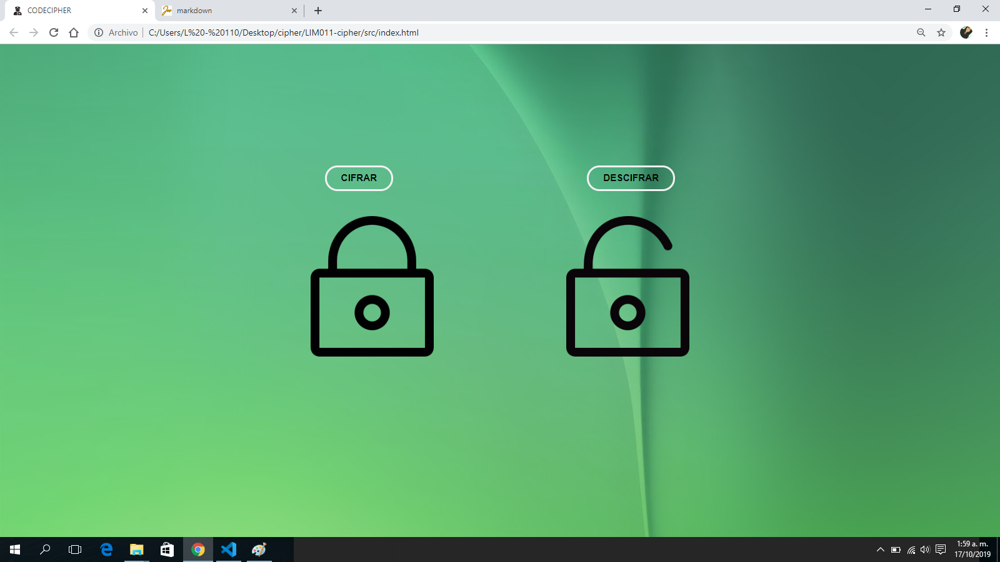
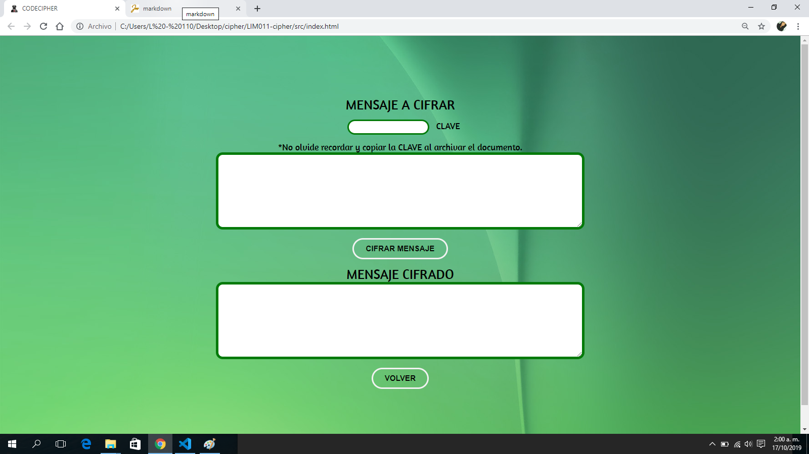

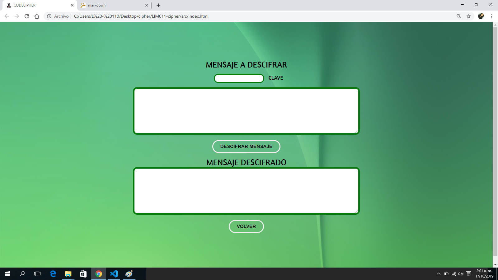

## INVESTIGACION UX:
* **USUARIOS Y OBEJTIVOS:**  
 El usuario al que va dirigido esta App son para las comisarias de mi ciudad, tiene como objetivo mantener una confidencialidad al momento de archivar las denuncias.

 * **SOLUCIONES:**  
 Al encriptar el contenido de la denuncia permite más confidencialidad y que solo cierto personal calificado tenga acceso a ella, evitando los posibles problemas de seguridad.

* **FOTO DE MI PRIMER PROTOTIPO:**  
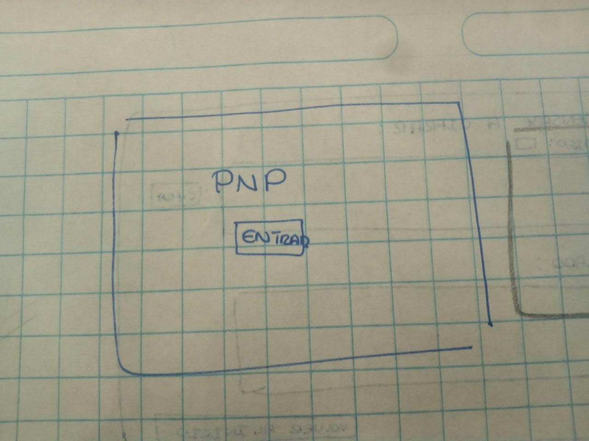
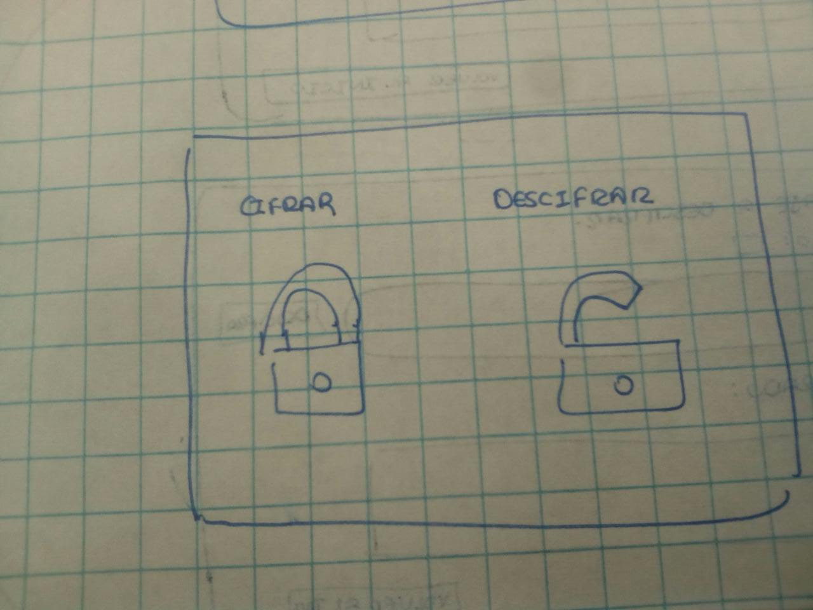
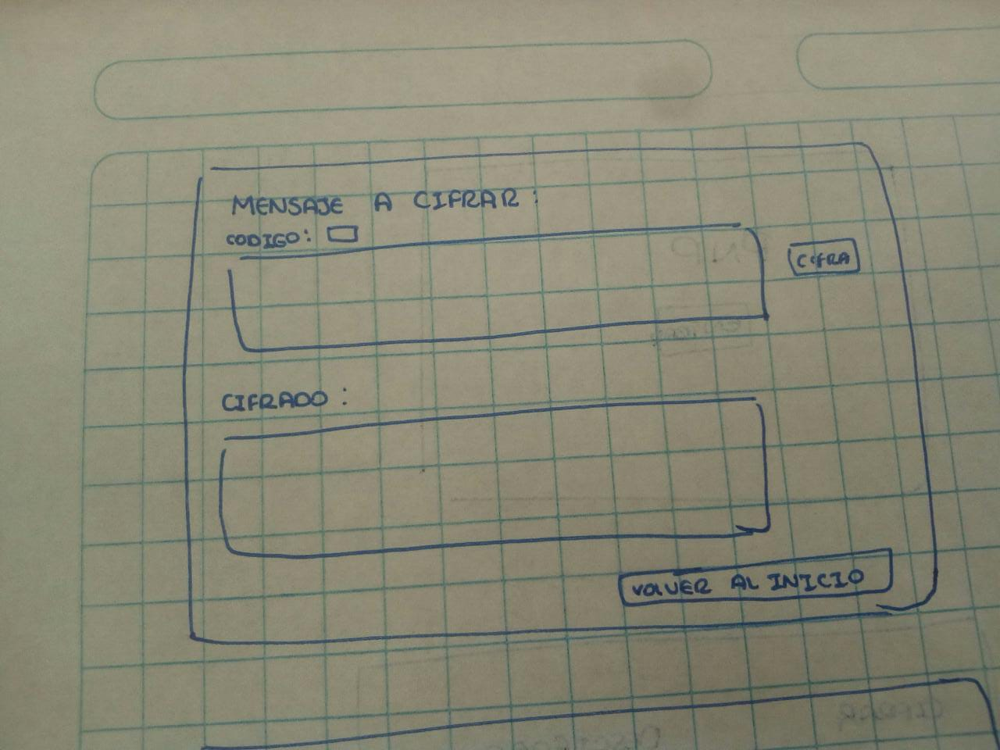
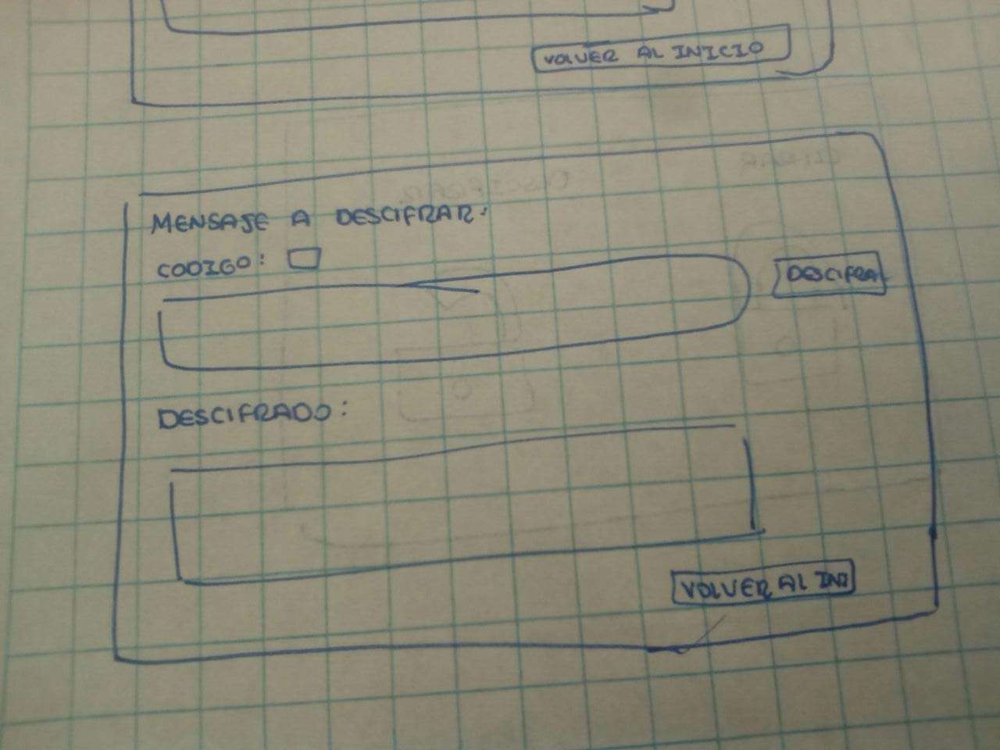

* **FEEDBACK A MI PROYECTO:**  
* mejorar la interfaz de vista 
* al inicio tendria un incio de sesión pero me recomendaron priorizar mis objetivos y si tenia tiempo recien aunmentarle esa ventana.

* **FOTO DE PROTOTIPO FINAL:**
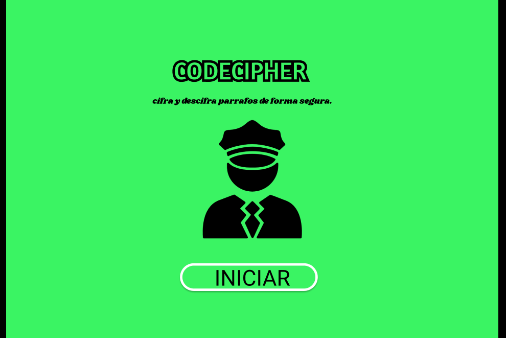
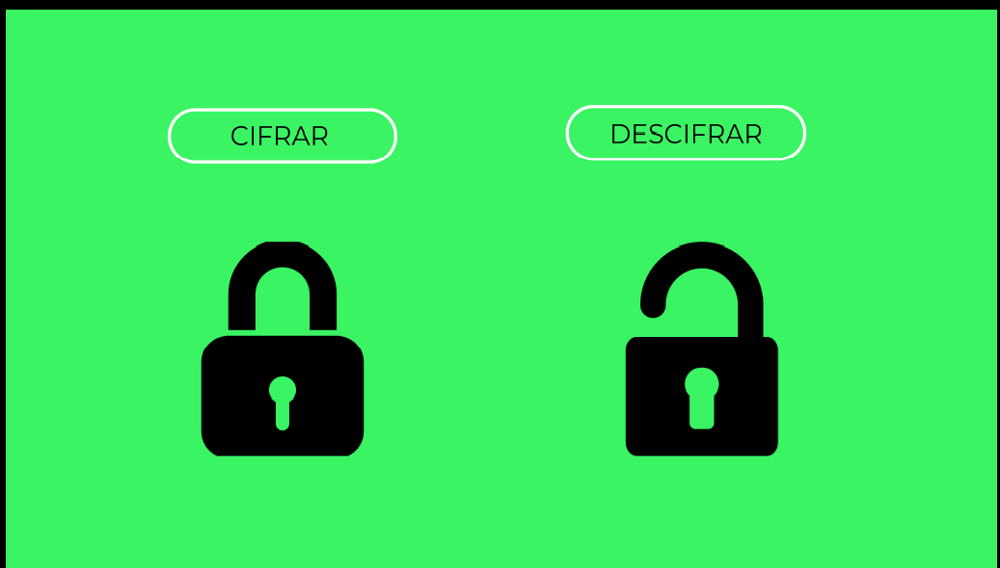
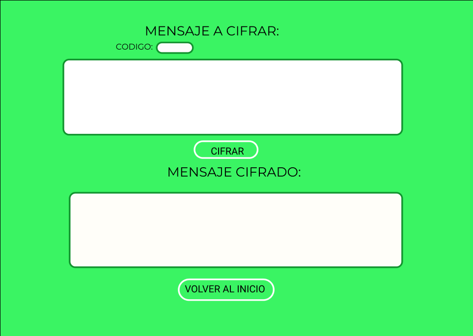
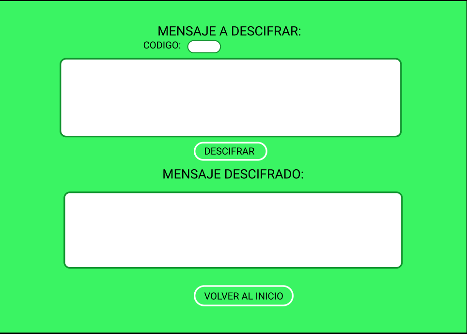

### UX
​
- [X] Diseñar la aplicación pensando y entendiendo al usuario.
- [X] Crear prototipos para obtener feedback e iterar.
- [X] Aplicar los principios de diseño visual (contraste, alineación, jerarquía).
​
### HTML y CSS
​
- [NO ] Uso correcto de HTML semántico.
- [NO ] Uso de selectores de CSS.
- [NO ] Construir tu aplicación respetando el diseño realizado (maquetación).
​
### DOM
​
- [NO] Uso de selectores del DOM.
- [X] Manejo de eventos del DOM.
- [NO] Manipulación dinámica del DOM.
​
### Javascript
​
- [ NO] Manipulación de strings.
- [NO ] Uso de condicionales (if-else | switch).
- [NO ] Uso de bucles (for | do-while).	
- [NO ] Uso de funciones (parámetros | argumentos | valor de retorno).
- [NO ] Declaración correcta de variables (const & let).
​
### Testing
- [NO ] Testeo de tus funciones.
​
### Git y GitHub
- [X] Comandos de git (add | commit | pull | status | push).
- [NO ] Manejo de repositorios de GitHub (clone | fork | gh-pages).
​
### Buenas prácticas de desarrollo
- [NO ] Uso de identificadores descriptivos (Nomenclatura | Semántica).
- [ ] Uso de linter para seguir buenas prácticas (ESLINT).

